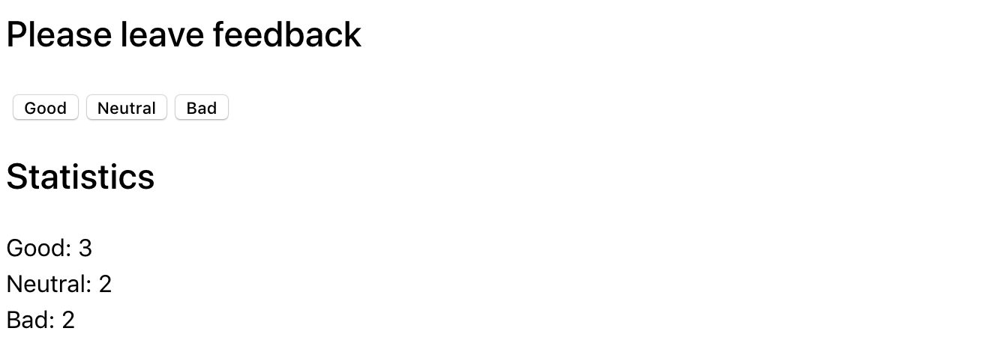

**Read in other languages: [Russian](README.md), [Ukrainian](README.ua.md),
[English](README.en.md).**

# Feedback widget

Like most companies, Expresso Café collects feedback from its customers. Your
job is to create an app to collect statistics. There are only three options
feedback: good, neutral and bad.

## Step 1.

The app should display the amount of feedback collected for each category. The
app should not save feedback statistics between different sessions (page
refresh).

The state of the app must necessarily be of the following form, no new
properties cannot be added.

```
state = {
  good: 0,
  neutral: 0,
  bad: 0
}
```

The interface might look like this.



## Step 2

Expand the app's functionality so that the interface displays more of the
collected feedback. Add a display of the total number of collected reviews from
all categories, and the percentage of positive reviews. To do this, create
helper methods `countTotalFeedback()` and `countPositiveFeedbackPercentage()`,
which calculate these values based on state data (computable data).


## Step 3.

Refactor the application. The state of the application must remain in the the
root component `<App>`.

- Put the statistics display in a separate component
  `<Statistics good={} neutral={} bad={} total={} positivePercentage={}>`.
- Put the button box into a component
  `<FeedbackOptions options={} onLeaveFeedback={}`.
- Create a component `<Section title="">`, which renders a section with title
  and children. Wrap each of the `<Statistics>` and `<FeedbackOptions>` in
  created section component.

## Step 4

Extend the application's functionality so that the statistics block is rendered
only after after at least one review has been collected. The message about no
statistics put in the component `<Notification message="No feedback given">`.


