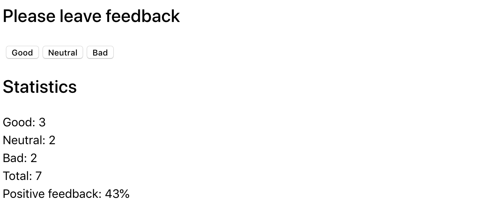

**Read in other languages: [Russian](../README.md),
[Ukrainian](./README.ua.md).**

## Events and State.

_In this section of the course, I will explore how to manage events and state in
a React application using class components, as well as how to type a class
component with TypeScript. My goal is to create an application for collecting
statistics. There will be three options for feedback: good, neutral, and bad._

---

<details>
<summary>Feedback Widget Preview</summary>


</details>

---

#### My feedback widget project will implement the following:

1. **Application State**: I will create a class component `<App>` that will
   store the application state as an object. The state will contain the number
   of collected feedbacks in three categories: good, neutral, and bad. The
   initial state will look like this:

```ts
state = {
  good: 0,
  neutral: 0,
  bad: 0,
};
```

<details>
<summary><b><em>The interface might look like this:</em></b></summary>


</details>
<br>

2. **Event Handling**: For each feedback option (good, neutral, bad), I will add
   an event handler that will update the state when the corresponding button is
   pressed. This will allow the user to interact with the application, and the
   state will change based on the feedback.
    <!-- ignore-prettier -->
   <br>

3. **Calculation Methods**: I will implement helper methods for counting:

   - `countTotalFeedback()` — returns the total number of collected feedbacks,
     calculated based on the state.
   - `countPositiveFeedbackPercentage()` — calculates the percentage of positive
     feedbacks based on the data in the state.

<details>
<summary><b><em>The interface might look like this:</em></b></summary>



</details>
<br>

4. **Dynamic Interface Update**: Based on the current state and processed
   events, I will dynamically update the application interface. For example, the
   statistics will be displayed only after at least one feedback has been
   collected, and if there are no feedbacks, a message indicating that the
   statistics are unavailable will be shown.
    <!-- ignore-prettier -->
   <br>

By using class components, I will be able to manage state and events, which will
help me gain a deeper understanding of how React works and how components
interact.
